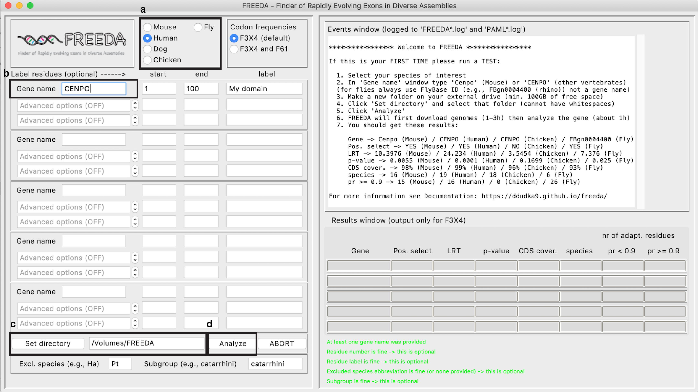

# 

FREEDA
======
FREEDA (Finder of Rapidly Evolving Exons in De novo Assemblies) is a Python built end-to-end 
automated pipeline to detect positive selection, created for experimental cell biologists 
without training in computational biology and molecular evolution. 

- Documentation: [https://ddudka9.github.io/freeda/](https://ddudka9.github.io/freeda/)
- Source code: [https://github.com/DDudka9/freeda](https://github.com/DDudka9/freeda)
- Requirements:
	- min 100 GB of disc space for each taxon e.g. primates (we recommend a hard drive with 500GB space)
	- Internet connection

If you use FREEDA for published work, please cite the original paper: CITATION

FREEDA is published under the GPLv3 license.

Created by Damian Dudka (damiandudka@0gmail.com) and R. Brian Akins

How to get started
==================

MacOS
-----

1. Download the latest MacOS release from the GitHub Releases page: 
	[https://github.com/DDudka9/freeda/releases/tag/v1.0.0-mac](https://github.com/DDudka9/freeda/releases/tag/v1.0.0-mac)
2. Install PyMOL https://pymol.org/2 in your Applications folder (takes minutes)
3. Double-click the .app file to run FREEDA (it might take a minute to load) and follow the steps depicted below.

(Find exhaustive walkthrough and explanation of the results in Documentation: [https://ddudka9.github.io/freeda/](https://ddudka9.github.io/freeda/))

Linux
-----

1. Download the latest Linux release (compatible with Ubuntu 22.04.1 LTS) from the GitHub Releases page: 
	[https://github.com/DDudka9/freeda/releases/tag/v1.0.0-linux](https://github.com/DDudka9/freeda/releases/tag/v1.0.0-linux)
2. "Double-click" the .zip file -> Extract (anywhere is fine)
3. Press ctrl + alt + t to open Terminal window. Drag and drop the extracted file and press ENTER to open FREEDA GUI (it might take a minute to load)

Windows
-------

FREEDA is not available for Windows. However, it is easy to run FREEDA from a free Virtual Machine running Linux inside a Windows computer. 
Setting up a Virtual Machine takes minutes. See Documentation: [https://ddudka9.github.io/freeda/](https://ddudka9.github.io/freeda/)
